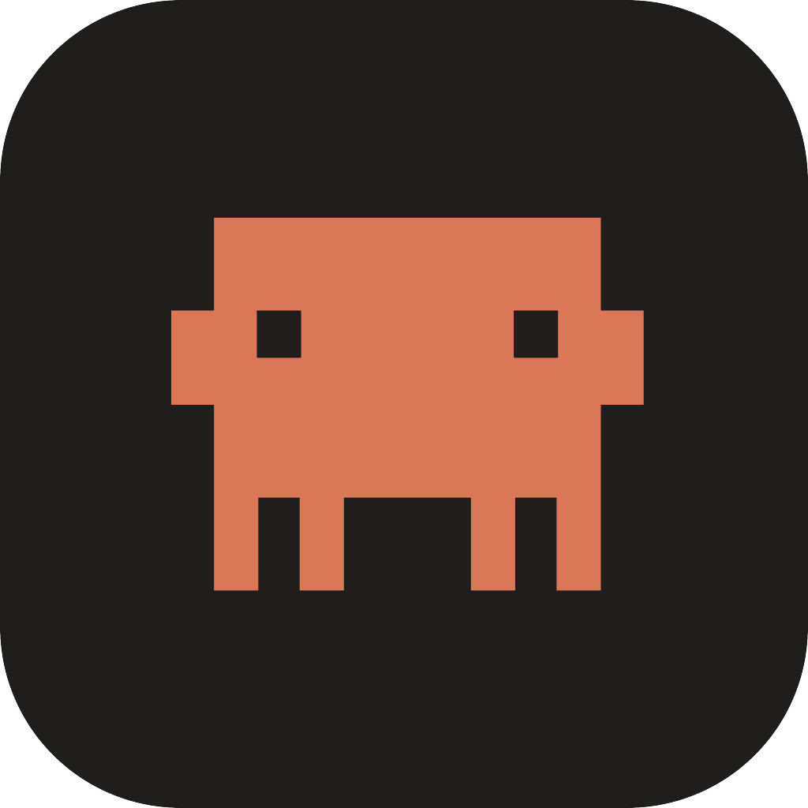
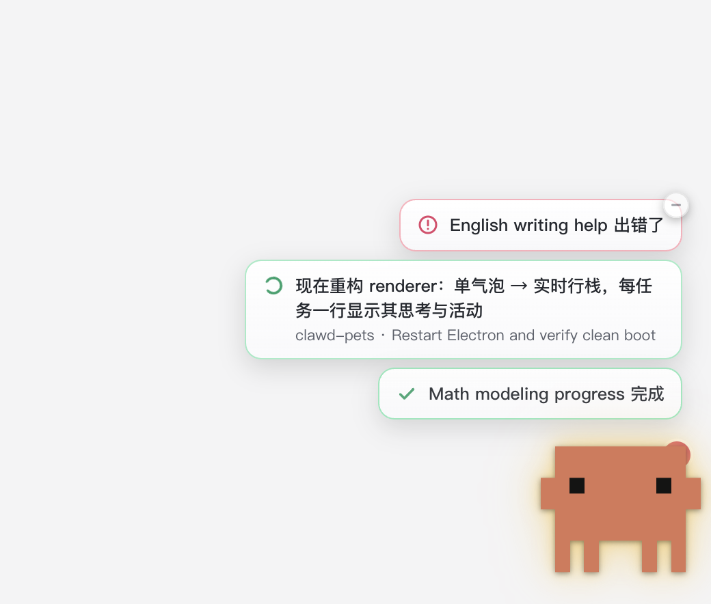

<p align="center">
  
</p>

<h1 align="center">Clawd Pets</h1>

<p align="center">
  <b>常驻置顶的桌宠，把你所有 Claude 任务一眼看全</b><br>
  An always-on-top desktop pet (Clawd) that watches all your Claude tasks at a glance
</p>

<p align="center">
  
  
  
  
</p>

<p align="center">
  
</p>

> 把 Claude 桌面端**所有任务**（Cowork / Code / 终端）的**实时进度、状态、用量**汇到屏幕一角——多任务一眼看全，谁在跑、谁要你、谁出错、谁完成。灵感来自 OpenAI 的 Codex Pets，为 Claude 生态打造。**纯读本地文件、不写、不改任何 Claude 配置。**
>
> 设计与可行性：[PLAN.md](PLAN.md) · 路线图：[ROADMAP.md](ROADMAP.md) · 对标 Codex Pets 的功能清单：[CODEX_PARITY.md](CODEX_PARITY.md)

---

## 它能做什么

- **多任务实时状态栈** — 折叠态在桌宠上方堆叠显示每个进行中任务一行：
  - **主行 = 当前思考叙述**（从 transcript 抽最近一句），**副行 = 任务名 · 当前工具动作**（如 `Restart Electron and verify clean boot`），对标 Claude Code 的状态行。
  - 按优先级排序：出错/限流/等你确认置顶，运行其次，完成垫底；超过 5 个折叠成"还有 N 个"。
  - 内容用 keyed reconcile **原地更新**，状态不变不重弹（不闪）。
- **官方 Clawd 形象** — 像素几何 1:1 取自 Claude Code 官方资产；情绪光晕（空闲/思考/运行/完成/需要你/出错）、呼吸、随机眨眼、**视线跟随光标**、长时间空闲会**睡着**。
- **实时用量限额** — 可选接官方用量端点，显示 5h / 每周 / Sonnet / Opus 真实利用率与重置倒计时；任一额度 ≥90% 时桌宠转红预警。
- **可调大小** — 拖桌宠右下角手柄连续缩放（或托盘"桌宠大小"小/中/大）。
- **可最小化** — 气泡栈右上角"—"收起只留 Clawd；状态实质变化自动弹回，点 Clawd 手动展开。
- **不挡操作** — 透明窗默认鼠标穿透，只有指针落在桌宠/气泡/面板实体上才接管点击。
- **记住设置** — 窗口范围、刷新率、实时用量、动效、桌宠大小、拖动位置，重启保留。
- **菜单栏托盘** — 切窗口范围(30m/2h/24h)、刷新频率、实时用量、通知、动效、桌宠大小、显隐、退出。

## 安装与运行

需要 macOS + Node.js。

```bash
npm install     # 装 Electron
npm start       # 启动桌宠（右下角浮窗 + 菜单栏图标）
npm test        # 跑状态推导单元测试 (node --test)
npm run check   # 打印一次 collect() 结果，快速验证数据层
```

> 国内装 Electron 慢/失败：本项目用 `npmmirror` 镜像即可（见各仓库的 electron 镜像说明）。

## 打包成 App（双击打开）

不想每次开终端跑 `npm start`，可打包成可双击的 macOS `.app`：

```bash
npm run pack    # electron-builder 产出 dist/mac*/Clawd Pets.app
```

产物在 `dist/` 下（如 `dist/mac-arm64/Clawd Pets.app`）。**首次打开**：因未做代码签名，会被 Gatekeeper 拦——**右键 → 打开 → 再确认一次**即可（之后正常双击）。可拖进「应用程序」并固定到 Dock / 用 Spotlight 启动。它是**纯菜单栏 App**（不占 Dock），启动后右下角出现 Clawd、顶栏出现单色 Clawd 图标。

图标由 `npm run icons` 从官方 Clawd 几何重新生成（`assets/` 下的菜单栏 template 图与 `.icns`，已随仓库提供，一般无需重跑）。

## 怎么用

- **看状态**：右下角 Clawd 上方自动堆叠所有进行中任务，一眼看全。
- **看详情**：点 Clawd 本体 → 展开任务面板（用量 / 5h 限额 / 配额条 / 每个会话的状态·进度·成本，可一键打开项目目录）。
- **调大小**：鼠标移到 Clawd，右下角出现斜纹手柄，按住往右下拖变大、左上变小。
- **最小化**：鼠标移到气泡栈，右上角"—"收起；点 Clawd 再展开。
- **托盘菜单**：菜单栏 emoji 图标，右键有全部开关。

## 实时用量限额（可选）

默认用本地 `rate_limit_event` 读数。托盘开启**实时用量**后，走官方 `GET /api/oauth/usage` 显示真实利用率：

- 复用 Claude Code 的 OAuth token（`~/.claude/.credentials.json` 或 macOS 登录钥匙串，首次弹系统授权框 = 你的同意点）。
- **token 只用于请求头，不落盘、不打印、只与 `api.anthropic.com` 通信。**
- 关键：该端点按 `User-Agent` 分限流桶——本项目用 `claude-code/<version>` 才不会被 429；请求 180s 一次 + 指数退避。
- 取不到 200 多半是**没有 Claude Code CLI 凭据**（只用 Cowork 桌面端时）——在终端登录一次 Claude Code 即可生成带用量权限的凭据，app 下一轮自动恢复。

## 架构

```
src/
  collector.js   数据层：读三类任务 + 用量 + todo + 5h 限额，推导状态/情绪/思考摘要
  pricing.js     单价表（①② 成本估算）
  usage-api.js   实时用量（官方 OAuth 端点 + 钥匙串 token + 退避）
  store.js       设置持久化（userData/settings.json）
  main.js        主进程：置顶透明窗 / 托盘 / fs.watch 事件驱动 / 鼠标穿透 / 窗口尺寸
  preload.js     contextBridge 暴露的最小 API
  renderer/      Clawd 形象 + 状态行栈 + 任务面板（index.html / renderer.js / styles.css）
test/            collector 状态推导单元测试
phase0/          早期纯命令行探针（数据源/hook 验证，非出货路径）
```

监控的三类任务与数据源（均本地、只读）：

1. **终端 / "Code" 标签** — `~/.claude/projects/<enc-cwd>/<id>.jsonl`
2. **旧版 Cowork** — 同上 + `claude-code-sessions/.../local_*.json`（标题/串联）
3. **新版沙箱 Cowork** — `local-agent-mode-sessions/.../audit.jsonl`（含真实 `total_cost_usd`）

旁路信号：`~/.claude/sessions/<pid>.json`（进程存活）、`~/.claude/tasks/<sid>/*.json`（todo）、audit 的 `rate_limit_event`（限额）。`fs.watch` 这些目录 → 文件一变即重算，状态近实时。

> 没有任何文件带显式"运行中/出错"标志位——状态全靠**推导**（末尾内容 + 工具是否返回 + mtime 新鲜度 + 进程存活交叉验证）。判定逻辑有单元测试覆盖。

## 隐私与安全

- **纯本地、只读**：只读取上面列出的 `~/.claude` 与 Claude 应用数据目录，从不写入或修改它们。
- **不自启动联网**：实时用量默认关闭；开启后仅与 `api.anthropic.com` 通信，OAuth token 只进 `Authorization` 头、不落盘不打印。
- **不发送你的对话**：transcript 仅在本机解析出"状态/进度/最近一句叙述"，不外传。
- 发布仓库已 `.gitignore` 本地配置（`.claude/`、`.npmrc`）与构建产物。

## 已知限制

- 状态是推导值；新版沙箱 Cowork(③) 无 host pid，无法区分"长工具在跑"与"卡住废弃"，靠新鲜度近似。
- ①② 的 `$` 是单价估算（标 `~`），订阅制不按此计费，仅量级参考；③ 沙箱为真实成本。
- 交互（回复/批准）暂未做——监控是核心，且对 App 内沙箱任务不可靠（见 PLAN.md §5）。

## 致谢与许可

- "Clawd" 是 Anthropic 为 Claude Code 设计的吉祥物；本项目复刻其像素形象用于 Claude 生态的伴随工具，形象版权归 Anthropic。
- 本项目自身代码以 [MIT](LICENSE) 许可。
